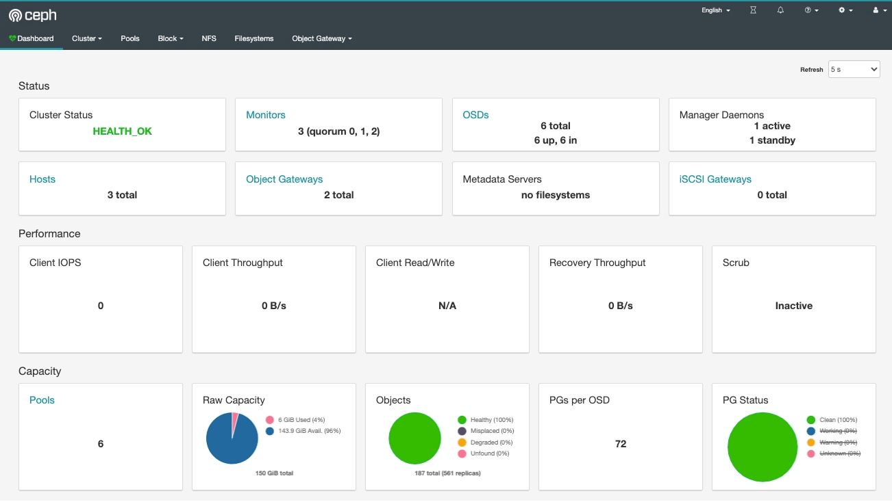

# Ceph 集群搭建
---------------------

本实验使用 ceph-deploy 搭建 ceph 集群，用到的操作系统和软件版本如下：
- os: CentOS Linux release 7.9.2009 
- ceph: Nautilus(14.2.22)

| 主机名         | public网段          | cluster网段        | 角色                          |
|-------------|-------------------|------------------|-----------------------------|
| ceph-node01 | 172.16.192.131/16 | 172.16.63.131/16 | ceph-admin、mon、rgw 、mgr、osd |
| ceph-node02 | 172.16.192.132/16 | 172.16.63.132/16 | mon、mgr、mds、osd             |
| ceph-node03 | 172.16.192.133/16 | 172.16.63.133/16 | mon、rgw、mds、osd             |

ceph-admin 为管理节点，此处共有ceph-node01节点

## 1. 基础环境准备

```shell
# 关闭防火墙
for i in stop disable;do systemctl $i firewalld; done
# 关闭selinux
sed -i 's/enforcing/disabled/' /etc/selinux/config && setenforce 0
# 禁用 NetworkManager
systemctl disable NetworkManager && systemctl stop NetworkManager
# 主机名解析
cat >> /etc/hosts <<EOF
172.16.63.231 ceph-node01
172.16.63.232 ceph-node02
172.16.63.233 ceph-node03
EOF
# 优化内核参数
echo "ulimit -SHn 102400" >> /etc/rc.local
cat >> /etc/security/limits.conf << EOF
* soft nofile 65535
* hard nofile 65535
EOF
cat >> /etc/sysctl.conf << EOF
kernel.pid_max = 4194303
EOF
echo "vm.swappiness = 0" >> /etc/sysctl.conf
sysctl -p
# 时间同步
echo "*/5 * * * * /usr/sbin/ntpdate time1.aliyun.com &> /dev/null && hwclock -w" >> /var/spool/cron/root
```

## 2. 准备Ceph集群

```shell
# 添加 ceph 源
rpm -ivh https://mirrors.aliyun.com/ceph/rpm-nautilus/el7/noarch/ceph-release-1-1.el7.noarch.rpm
# 在所有节点创建ceph的特定账号
useradd cephadm
echo "cephadm" | passwd --stdin cephadm
# 授权sudo
echo "cephadm ALL = (root) NOPASSWD:ALL" | sudo tee /etc/sudoers.d/cephadm 
chmod 0440 /etc/sudoers.d/cephadm
# 管理节点（admin）上生成SSH密钥并将其公钥分发至Ceph集群的各节点
su - cephadm
ssh-keygen  -t rsa
for i in ceph-node{01,02,03};do ssh-copy-id $i;done
```
## 3. 安装 Ceph 集群

### 3.1 准备集群相关配置文件目录

首先在管理节点上以cephadm用户创建集群相关的配置文件目录

```shell
su - cephadm
mkdir ceph-cluster && cd ceph-cluster
```

### 3.2 管理节点安装 ceph-deploy

```shell
sudo yum install -y ceph-deploy python-setuptools python2-subprocess32
```

### 3.3 创建 Monitor 节点

Ceph 存储集群需要至少运行一个 Ceph Monitor和一个Ceph Manager，生产环境中，为了实现高可用性，Ceph存储集群通常运行多个监视器，以免单监视器整个存储集群崩溃。Ceph使用Paxos算法，该算法需要半数以上的监视器（大于n/2，其中n为总监视器数量）才能形成法定人数。尽管此非必需，但奇数个监视器往往更好。使用下面的命令，可以将 ceph-node01、ceph-node02、 ceph-node03运行为 Monitor 节点。

```shell
ceph-deploy new --public-network 172.16.192.0/24 --cluster-network 172.16.63.0/24  ceph-node01 ceph-node02 ceph-node03
```

#### 3.3.1 所有节点安装ceph软件

ceph-deploy命令能够以远程的方式连入Ceph集群各节点完成程序包安装等操作。

```shell
# 将ceph-node01、ceph-node02和ceph-node03配置为Ceph集群节点
ceph-deploy install ceph-node01 ceph-node02 ceph-node03
# 如果提前在各节点安装了ceph软件，可以通过 --no-adjust-repos 跳过重新安装
ceph-deploy install --no-adjust-repos ceph-node01 ceph-node02 ceph-node03 
```

> 通常为了加速deploy 安装过程，我们会提前在 ceph 节点上执行下面的命令,提前安装ceph相关软件

```shell
yum install -y ceph ceph-radosgw 
```

#### 3.3.2 生成 Monitor 检测集群所使用的的秘钥

在节点上会启动一个 ceph-mon 进程，并且以 ceph 用户运行。在 /etc/ceph 目录会生成一些对应的配置文件，其中 ceph.conf 文件就是从前面 ceph-cluater 文件直接copy过去的，此文件也可以直接进行修改

```shell
ceph-deploy mon create-initial
# 分发配置文件到集群个节点
ceph-deploy admin ceph-node01 ceph-node02 ceph-node03
```
### 3.3 创建 Mgr 节点

对于Luminious+版本 或以后的版本，必须配置Manager节点，启动ceph-mgr进程，否则ceph是不健康的不完整的。Ceph Manager守护进程以“Active/Standby”模式运行，部署其它ceph-mgr守护程序可确保在Active节点或其上的 ceph-mgr守护进程故障时，其中的一个Standby实例可以在不中断服务的情况下接管其任务。 Mgr 是一个无状态的服务，所以我们可以随意添加其个数，通常而言，使用 2 个节点即可。

```shell
ceph-deploy  mgr create ceph-node01 ceph-node02
```
### 3.4 创建 Rgw 节点

Rgw 用来提供对象存储,

```shell
ceph-deploy rgw create ceph-node01 ceph-node03
```

### 3.5 创建 Mds 节点

Mds 用来提供 CephFS

```shell
ceph-deploy mds create ceph-node02 ceph-node03
```

### 3.6 添加 Osd

在此 ceph 集群中，我们每台机器使用了三块硬盘 ，/dev/sda、/dev/sdb、/dev/sdc， 其中/dev/sda是系统盘，/dev/sdb、/dev/sdc,是我们接下要添加为 OSD 的磁盘.

#### 3.6.1 擦除磁盘(可选操作)

```shell
# ceph-node01 
ceph-deploy disk zap ceph-node01  /dev/sdb
ceph-deploy disk zap ceph-node01  /dev/sdc
# ceph-node02
ceph-deploy disk zap ceph-node02  /dev/sdb
ceph-deploy disk zap ceph-node02  /dev/sdc
# ceph-node03
ceph-deploy disk zap ceph-node03  /dev/sdb
ceph-deploy disk zap ceph-node03  /dev/sdc
```

#### 3.6.2 添加为Osd

```shell
# ceph-node01
ceph-deploy osd create ceph-node01 --data /dev/sdb
ceph-deploy osd create ceph-node01 --data /dev/sdc
# ceph-node02
ceph-deploy osd create ceph-node01 --data /dev/sdb
ceph-deploy osd create ceph-node01 --data /dev/sdc
# ceph-node03
ceph-deploy osd create ceph-node01 --data /dev/sdb
ceph-deploy osd create ceph-node01 --data /dev/sdc
```

### 3.7 启用Dashboard

```shell
# 在所有 mgr 节点安装dashboard 软件包
sudo yum install ceph-mgr-dashboard -y
# 启用 ceph mgr dashboard
ceph mgr module enable dashboard
# 创建自签名证书
ceph config set mgr mgr/dashboard/ssl false
ceph mgr services
{
    "dashboard": "http://ceph-node02:8080/"
}
# 创建用户
echo "admin"  > ~/password.txt
ceph dashboard ac-user-create admin -i ~/password.txt administrator
```


## 4. 验证集群

通过 ceph -s 命令验证， 如果没有 ceph 命令则需要安装 ceph-common ，为了能让 ceph-admin 也能执行ceph -s命令，我们需要安装 ceph-common 命令，并且通过 ceph-deploy admin推送配置文件给 ceph-admin,并设置cephadm 对 配置文件有可读权限

```shell
# 推送配置文件到 ceph-admin，此处为ceph-node01，可忽略
sudo yum install -y ceph-common
ceph-deploy admin ceph-admin
sudo setfacl -m u:cephadm:r /etc/ceph/ceph.client.admin.keyring

# 查看集群状态
~]$ ceph -s
  cluster:
    id:     dd75a453-9513-4dd9-a64c-6aba7cd50b08
    health: HEALTH_OK
 
  services:
    mon: 3 daemons, quorum ceph-node01,ceph-node02,ceph-node03 (age 4h)
    mgr: ceph-node02(active, since 4h), standbys: ceph-node01
    mds:  2 up:standby
    osd: 6 osds: 6 up (since 4h), 6 in (since 42h)
    rgw: 2 daemons active (ceph-node01, ceph-node03)
 
  task status:
 
  data:
    pools:   6 pools, 144 pgs
    objects: 187 objects, 1.2 KiB
    usage:   6.0 GiB used, 144 GiB / 150 GiB avail
    pgs:     144 active+clean
```


