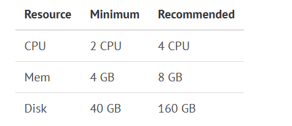
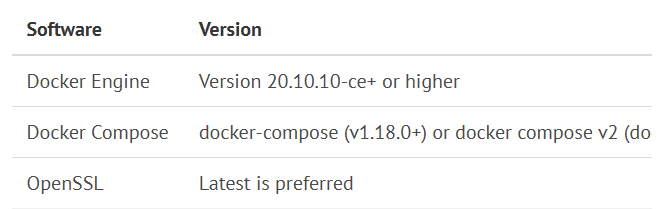

# 镜像仓库

## 1 Harbor


### 1.1 安装依赖

> 官网： `https://goharbor.io/docs/2.12.0/install-config/installation-prereqs/`




### 1.2 Harbor Installation Prerequisites

```shell
~# hostnamectl  set-hostname reg.linux.io
~# ufw disable
~# echo '192.168.1.250 reg.linux.io' >> /etc/hosts
```
### 1.3 Install docker

> 阿里云： `https://developer.aliyun.com/mirror/docker-ce?spm=a2c6h.13651102.0.0.3e221b11McV0m7`

```shell
# step 1: 安装必要的一些系统工具
sudo apt-get update
sudo apt-get install ca-certificates curl gnupg

# step 2: 信任 Docker 的 GPG 公钥
sudo install -m 0755 -d /etc/apt/keyrings
curl -fsSL https://mirrors.aliyun.com/docker-ce/linux/ubuntu/gpg | sudo gpg --dearmor -o /etc/apt/keyrings/docker.gpg
sudo chmod a+r /etc/apt/keyrings/docker.gpg

# Step 3: 写入软件源信息
echo \
  "deb [arch=$(dpkg --print-architecture) signed-by=/etc/apt/keyrings/docker.gpg] https://mirrors.aliyun.com/docker-ce/linux/ubuntu \
  "$(. /etc/os-release && echo "$VERSION_CODENAME")" stable" | \
  sudo tee /etc/apt/sources.list.d/docker.list > /dev/null
 
# Step 4: 安装Docker
sudo apt-get update
sudo apt-get install docker-ce docker-ce-cli containerd.io docker-buildx-plugin docker-compose-plugin

# 安装指定版本的Docker-CE:
# Step 1: 查找Docker-CE的版本:
# apt-cache madison docker-ce
# Step 2: 安装指定版本的Docker-CE: (VERSION例如上面的17.03.1~ce-0~ubuntu-xenial)
sudo apt install docker-ce=5:26.1.3-1~ubuntu.20.04~focal
```

```shell
~# echo '
{
    "exec-opts": ["native.cgroupdriver=systemd"],
    "registry-mirrors": [
        "https://docker.rainbond.cc",
        "https://docker.1panel.live"
    ]

}
' |sudo tee /etc/docker/daemon.json

~# systemctl  daemon-reload  && systemctl restart docker
```

### 1.4 Install docker-compose

> 官网： `https://docs.docker.com/compose/install/#install-compose`

```shell
~# sudo curl -L "https://github.com/docker/compose/releases/download/1.23.2/docker-compose-$(uname -s)-$(uname -m)" -o /usr/local/bin/docker-compose
~# chmod +x /usr/local/bin/docker-compose
~# docker-compose version
docker-compose version 1.23.2, build 1110ad01
docker-py version: 3.6.0
CPython version: 3.6.7
OpenSSL version: OpenSSL 1.1.0f  25 May 2017
```

### 1.5 Download and Unpack the Installer

```shell
~# wget https://github.com/goharbor/harbor/releases/download/v2.12.1/harbor-offline-installer-v2.12.1.tgz
~# tar -xf harbor-offline-installer-v2.12.1.tgz  -C /opt/

```

### 1.6 Configure HTTPS Access to Harbor

```
~]# mkdir /opt/harbor/ssl
~]# cd /opt/harbor/ssl
```

```
1. Generate a CA certificate private key.
ssl]# openssl genrsa -out ca.key 4096
```

```
2. Generate the CA certificate.
ssl]# openssl req -x509 -new -nodes -sha512 -days 3650 \
 -subj "/C=CN/ST=Beijing/L=Beijing/O=example/OU=Personal/CN=reg.linux.io" \
 -key ca.key \
 -out ca.crt
```

```
3. Generate a private key for harbor server.
ssl]# openssl genrsa -out reg.linux.io.key 4096
```

```
4. Generate a certificate signing request (CSR).
ssl]# openssl req -sha512 -new \
    -subj "/C=CN/ST=Beijing/L=Beijing/O=example/OU=Personal/CN=reg.linux.io" \
    -key reg.linux.io.key \
    -out reg.linux.io.csr
```

```
5. Generate an x509 v3 extension file.
ssl]# cat > v3.ext <<-EOF
authorityKeyIdentifier=keyid,issuer
basicConstraints=CA:FALSE
keyUsage = digitalSignature, nonRepudiation, keyEncipherment, dataEncipherment
extendedKeyUsage = serverAuth
subjectAltName = @alt_names

[alt_names]
DNS.1=reg.linux.io
DNS.2=reg.linux.io
DNS.3=192.168.1.250
EOF
```

```
6. Use the v3.ext file to generate a certificate for your Harbor host.
ssl]# openssl x509 -req -sha512 -days 3650 \
    -extfile v3.ext \
    -CA ca.crt -CAkey ca.key -CAcreateserial \
    -in reg.linux.io.csr \
    -out reg.linux.io.crt
```

### 1.7 Configure the Harbor YML File

```shell
/opt/harbor/ssl# cp /opt/harbor/harbor.yml.tmpl /opt/harbor/harbor.yml
/opt/harbor/ssl# vim /opt/harbor/harbor.yml
hostname: reg.linux.io
# http related config
http:
  # port for http, default is 80. If https enabled, this port will redirect to https port
  port: 80

# https related config
https:
  # https port for harbor, default is 443
  port: 443
  # The path of cert and key files for nginx
  certificate: /opt/harbor/ssl/reg.linux.io.crt
  private_key: /opt/harbor/ssl/reg.linux.io.key
```

### 1.8 Run the `prepare` script to enable HTTPS

```shell
~# cd /opt/harbor/ && ./prepare
~# cd /opt/harbor/ && ./install.sh
```

### 1.9 Provide the Certificates to Harbor and Docker

```shell
/opt/harbor# cd ssl/
/opt/harbor/ssl# openssl x509 -inform PEM -in reg.linux.io.crt -out reg.linux.io.cert

cp reg.linux.io.cert  /etc/docker/certs.d/reg.linux.io/
cp reg.linux.io.key  /etc/docker/certs.d/reg.linux.io/
cp ca.crt  /etc/docker/certs.d/reg.linux.io/
```
```shell
~#  docker login reg.linux.io -u admin -p Harbor12345
WARNING! Using --password via the CLI is insecure. Use --password-stdin.
WARNING! Your password will be stored unencrypted in /root/.docker/config.json.
Configure a credential helper to remove this warning. See
https://docs.docker.com/engine/reference/commandline/login/#credential-stores

Login Succeeded
```

### 1.10 Upload image to Harbor

```shell
docker pull ikubernetes/myapp:v1
docker tag ikubernetes/myapp:v1  reg.linux.io/library/myapp:v1
docker push reg.linux.io/library/myapp:v1
```