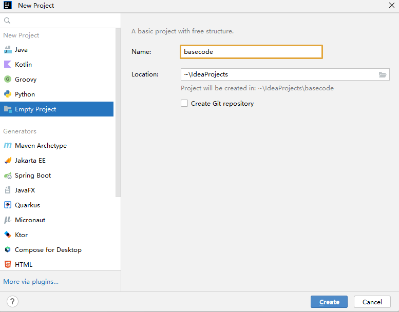
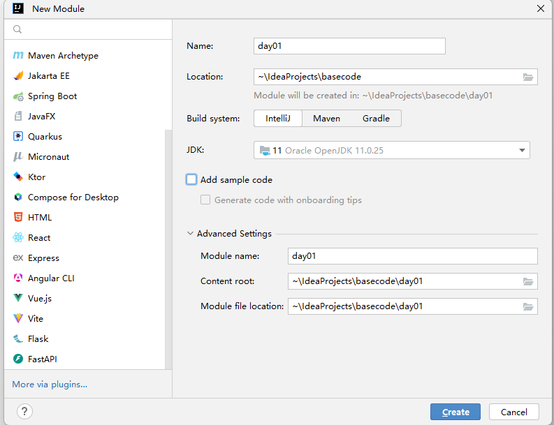
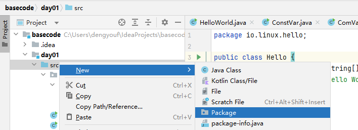
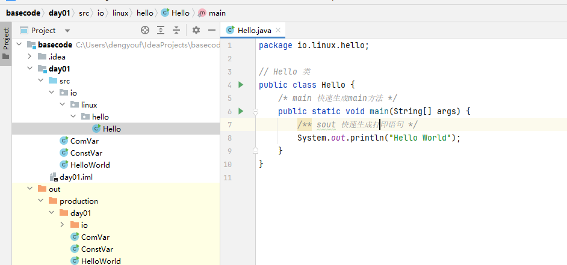
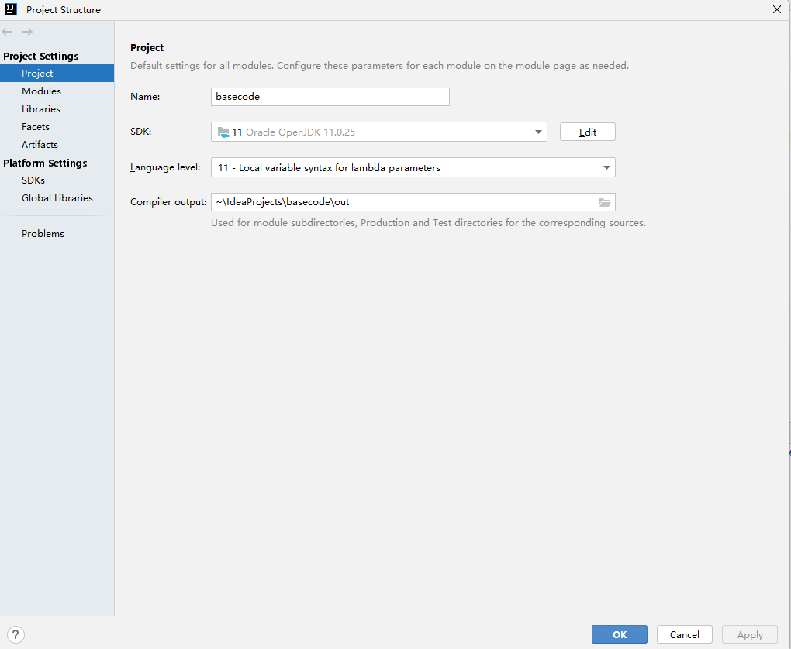

# Java 基础

## 1. Idea 使用

- 新建项目-basecode



- 新建模块-day01




- 新建包-io.linux.io



- 新建类-Hello




```java
package io.linux.hello;

// Hello 类
public class Hello {
    /* main 快速生成main方法 */
    public static void main(String[] args) {
        /** sout 快速生成打印语句 */
        System.out.println("Hello World");
    }
}
```

- 设置 SDK 和 语言级别



## 2. Java语法基础

### 2.1 常量

字面量或者称为常量, 表示代码执行期间，其值不能发生改变的量.

| 常量  | 表达方式            | 备注          |
|-----|-----------------|-------------|
| 字符串 | "hello world"   | 使用双引号括起来的内容 |
| 整数  | 18 -18 120      | 所有的整数       |
| 小数  | 3.14 -5.66 -1.0 | 所有的小数       |
| 字符  | 'a'   '国'       | 使用单引号括起来的内容 |
| 布尔  | true false      |             |
| 空常量 | null            | 不能直接打印      |

```java
public class ConstVar {
    public static void main(String[] args) {
        System.out.println("Hello World");
        System.out.println('A');
        System.out.println((int)'A');
        System.out.println(19);
        System.out.println(3.14);
    }
}
```

### 2.2 变量

程序执行过程中，在某个范围内其值可以发生变化的量，本质是一段命名的内存空间。

- 格式：`数据类型 变量名 = 字面常量`

```shell
public class ComVar {
    public static void main(String[] args) {
        // 变量的作用域在 {} 内
        {
            int i; // 先声明
            i = 10;   // 初始化
            System.out.println(i);

            // 声明的同时进行初始化
            int ii = 20;
            System.out.println(ii);
        }
        {
            int i =20;
            System.out.println(i);
        }

        // 同类型可以放在一行定义
        int a = 10, b=20, c=30;
        System.out.printf("a=%d, b=%d, c=%d\n", a, b, c);
    }
}
```

### 2.3 基本数据类型

| 基本数据类型 | 类型         | 字节数 | 数据范围            |
|--------|------------|-----|-----------------|
| 整数类型   | byte       | 1   | -128~127        |
|        | short      | 2   | -2^15 ~2^15 - 1 |
|        | int(默认)    | 4   | -2^31 ~ 2^31 -1| 
|        | long       | 8   | -2^63~2^63 -1|
| 浮点型    | float      | 4   | -3.40308 ~ -3.40308|
|        | double(默认) | 8   | -1.79E308 ~ -1.79E308|
| 字符类型   | char       | 2   | 0~65535 |
| 字符串    | String     |    | |
| 布尔类型   | boolean    | 1   | true or false |

```java
public class DemoVar {
    public static void main(String[] args) {
        // 长整型需要在数字后添加l或者L，建议使用L
        long num = 800000000L;
        System.out.println(num);

        // 浮点型需要在数字后添加 f 或者 F，推荐使用F
        float num2 = 8.0f;
        System.out.println(num2);

        // 强制类型转换
        char ch = 'a';
        System.out.println((int)ch);
    }
}
```

### 2.4 类型转换

当数据类型不一致时，需要进行类型转换

- 自动类型转换： 由小范围的数据类型转为大范围的数据类型，代码不需要处理，自动完成转换
- 显示类型转换： 由大范围的数据类型转为小范围的数据类型，要显示指定要转换的类型，可能会造成精度缺失，不推荐使用

```java
public class DemoTransf {
    public static void main(String[] args) {
        int a =10;
        long b = a;
        System.out.printf("a=%d, b=%d\n", a,b);

        // 任意一个整数都可以赋值给小数变量，但可能会导致进度丢失
        // 虽然 int 和 float 都为4个字节，但是 int 类型表示整数比 float 要多，所以会丢失精度
        int i = 1211111111;
        float f = i;
        System.out.printf("i=%d, f=%f\n", i,f);

        // 强制类型转换
        long m = 100L;
        int n = (int)m;
        System.out.printf("m=%d, n=%d\n", m,n);
    }
}
```

### 2.5 运算符

#### 2.5.1 算术运算符

| 符号 | 说明 |
|----|----|
| +  | 加  |
| -  | 减  |
| *  | 乘  |
| /  | 除  |
| %  | 取余 |
| ++ | 自增 |
| -- | 自减 |
| += |  |
| -= |  |
| *= |  |
| /= |  |
| %= |  |

```java
public class DemoOp {
    public static void main(String[] args) {
        int a = 10;
        int b = 3;
        // 两个整数运算，获取的结果一定是整数
        System.out.println(a / b);
        System.out.println(a % b);

        float m = 10.0f;
        float n = 3.0f;
        // 两个浮点数运算，结果该是多少就是多少
        System.out.println(m / n);
        System.out.println(m % n);

        // 只要 / 两端出现小数，其结果肯定是小数
        System.out.println(a / n);

        // 字符串+任意类型=字符串
        String s ="hello world";
        System.out.println(s+10);
    }
}
```

```java
public class SelfOp {
    public static void main(String[] args) {
        int a = 7;

        int c = ++a + 5 + --a  + 12  + a++;
        //  c = 8 + 5 + 7 + 12 + 7
        System.out.println(a); // 8
        System.out.println(c); // 39
    }
}
```

#### 2.5.2 赋值运算符

| 符号 | 说明 |
|----|----|
| += |  |
| -= |  |
| *= |  |
| /= |  |
| %= |  |

```java
public class SelfOp {
    public static void main(String[] args) {
        int a = 4;

        int num = a += a -= a *= ++a;
        // num = a += a -= (a *= ++a )
        // num = 4 += 4 -= (4 * 5)
        // num = 4 += 4 -= 20
        // num = 8 -= 20
        System.out.println(num);
    }
}
```


#### 2.5.3 关系运算符

关系运算符返回值一定是 boolean 类型

| 符号 | 说明   |
|----|------|
| == | 等于   |
| != | 不等于  |
| >  | 大于   |
| <  | 小于   |
| >= | 大于等于 |
| <= | 小于等于 |

#### 2.5.4 逻辑运算符

| 符号          | 说明 |
|-------------|----|
| & or &&     | 与  |
| \|  or \|\| | 或  |
| ^           | 异或 |
| !           | 取反 |

对于 `&&` 和 `||` 而言，具有短路效果，建议使用, `&&` 的优先级高于 `||`

```java
public class DemoLogic {
    public static void main(String[] args) {
        int a = 10;
        int b = 20;
        int c = 10;

        System.out.println((a == c) & (b>c));
        System.out.println((a == c) | (b>c));
        System.out.println((a == c) ^ (b>c));
        System.out.println((a == c) ^ (b>c));
        System.out.println(!((a == c) ^ (b>c)));

        System.out.println((a == c) && (b>c));
        System.out.println((a == c) || (b>c));
    }
}
```


#### 2.5.5 三目运算符

```java
public class DemothreeOp {
    public static void main(String[] args) {
        int a = (3<5)?1:4;
        System.out.println(a);

        int m=10, n=20;

        int max = m>n?m:n;
        System.out.println(max);
    }
}
```


### 2.6 控制台输入

```shell
// 导包
import java.util.Scanner;

public class StdInput {
    public static void main(String[] args) {
        // 创建
        Scanner sc = new Scanner(System.in);
        System.out.print("请输入一个整数: ");
        
        // 使用
        int i = sc.nextInt();
        System.out.println(i);
    }
}
```

### 2.7 流程控制

#### 2.7.1 顺序结构

从上而下顺序执行

```java
public class OrderExec {
    public static void main(String[] args) {
        System.out.println("11111111111111");
        System.out.println("22222222222222");
        System.out.println("33333333333333");
    }
}
```

#### 2.7.2 分支结构

- if 分支结构

```java
import java.util.Scanner;

public class DemoIf {
    public static void main(String[] args) {
        Scanner sc = new Scanner(System.in);
        System.out.print("请输入你的年龄：");
        int age = sc.nextInt();
        
        if (age >= 18)  // 单分支请{}内只有一条语句，{}可省略
            System.out.println("你已成年");
            

    }
}
```

- if-else 分支结构

```java
import java.util.Scanner;

public class DemoIf {
    public static void main(String[] args) {
        Scanner sc = new Scanner(System.in);
        System.out.print("请输入你的年龄：");
        int age = sc.nextInt();
        
        if (age >= 18){
            System.out.println("你已成年");
        } else {
            System.out.println("你未成年");
        }
        
    }
}
```

- if-else-if 分支结构

```java
import java.util.Scanner;

public class DemoIf {
    public static void main(String[] args) {
        Scanner sc = new Scanner(System.in);
        System.out.print("请输入你的分数：");
        float score = sc.nextFloat();

        if (score >= 80 && score < 100) {
            System.out.println("您的成绩：优秀");
        } else if (score >= 70 && score < 80) {
            System.out.println("您的成绩：良好");
        } else if (score >= 60 && score < 70) {
            System.out.println("您的成绩：合格");
        } else {
            System.out.println("您的成绩：不合格");
        }

    }
}
```
- switch语句

```java
import java.util.Scanner;

public class DemoSwitch {
    public static void main(String[] args) {
        Scanner sc = new Scanner(System.in);
        System.out.print("请输入一个数字: ");

        int num = sc.nextInt();
        switch (num) {
            case 1:
                System.out.println("星期一");
                break;
            case 2:
                System.out.println("星期二");
                break;
            case 3:
                System.out.println("星期三");
                break;
            case 4:
                System.out.println("星期四");
                break;
            case 5:
                System.out.println("星期五");
                break;
            case 6: 
            case 7:
                System.out.println("周末");
                break;
            default:
                System.out.println("输入错误");
        }
    }
}
```

#### 2.7.3 循环结构


- for 循环

```java
public class DemoFor {

    public static void main(String[] args) {
        int sum = 0;
        for (int i = 0; i < 10; i++) {
            System.out.println(i);
            sum+=i;
        }
        System.out.println(sum);
    }
    
}
```

- while 循环

```java
public class DemoWhile {
    public static void main(String[] args) {
        int i = 1;
        while (i < 10) {
            System.out.println(i);
            i++;
        }
    }
}
```

- do-while 循环

```java
public class DemoDoWhile {
    public static void main(String[] args) {
        int i = 0;
        do {
            System.out.println(i);
            i++;
        }while (i < 10);
    }
}
```

#### 2.7.5 break & contine

- break 结束循环，如果嵌套多个for循环，则中断最近的for循环，不影响外部的循环

```java
public class DemoBreak {
    public static void main(String[] args) {
        for (int i = 0; i < 5; i++) {
            if (i == 3) {
                break;
            }
            System.out.println(i);
        }
    }
}

---------------------------
0
1
2
```

- contine：跳过本次循环，直接进入下一次循环，如果嵌套多个for循环，则跳过最近的for循环，不影响外部的循环

```java
public class DemoBreak {
    public static void main(String[] args) {
        for (int i = 0; i < 5; i++) {
            if (i == 3) {
                continue; // 结束本次循环，返回
            }
            System.out.println(i);
        }
    }
}

----------------------------
0
1
2
4
```

### 3. 数组


