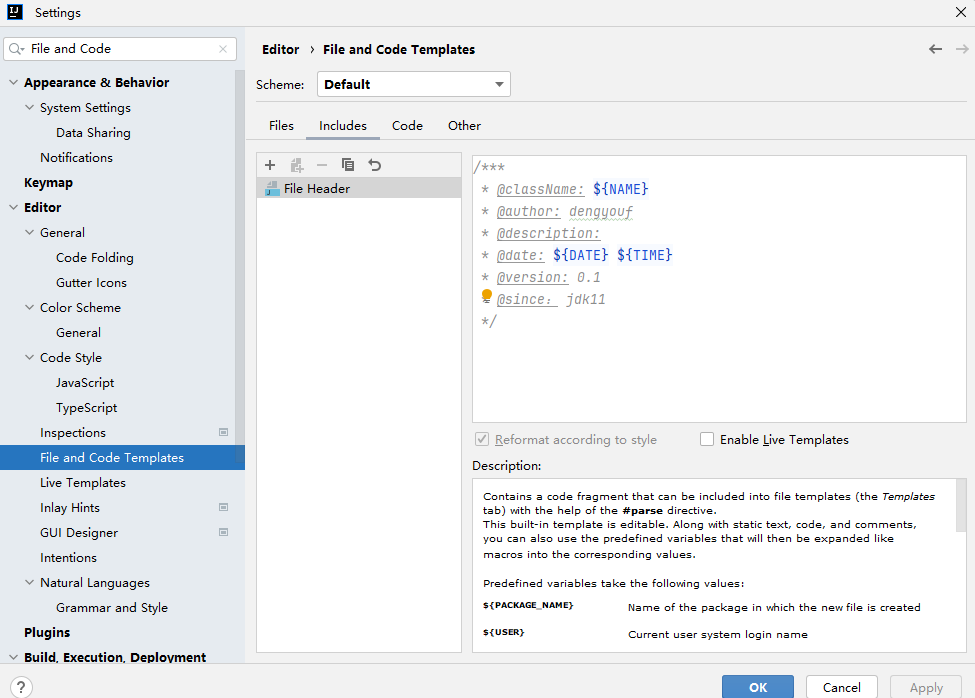
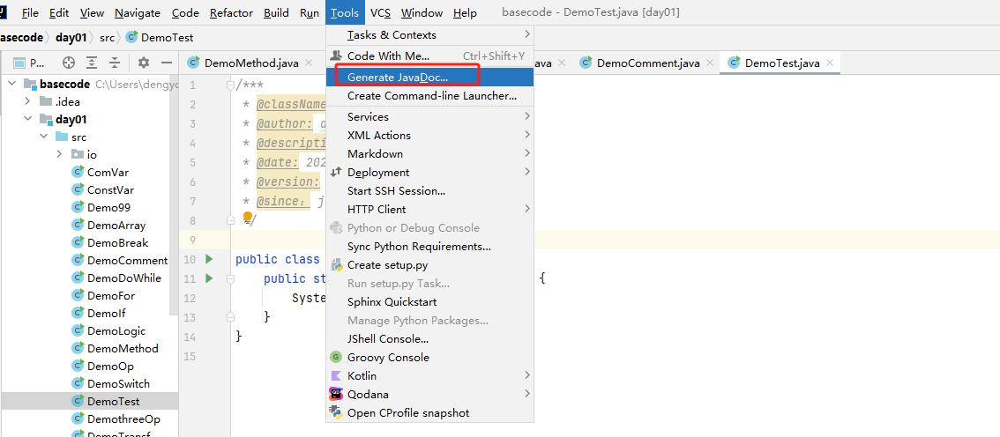
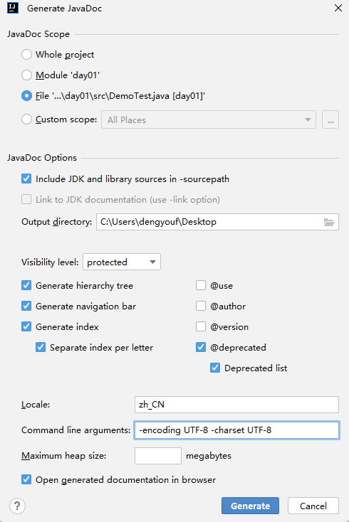

# Java 基础

## 1. Idea 使用

### 1.1 新建项目-basecode


### 1.2 新建模块-day01


### 1.3 新建包-io.linux.io


### 1.4 新建类-Hello


```java
package io.linux.hello;

// Hello 类
public class Hello {
    /* main 快速生成main方法 */
    public static void main(String[] args) {
        /** sout 快速生成打印语句 */
        System.out.println("Hello World");
    }
}
```

### 1.5 设置 SDK 和 语言级别


### 1.5 文档注释

给类或者方法添加注释，注释的内容会产生在生成的 java 文档中


```java
/***
 * @className: ${NAME}
 * @author: dengyouf
 * @description:
 * @date: ${DATE} ${TIME}
 * @version: 0.1
 * @since： jdk11
 */
```

```java
/***
 * @className: DemoTest
 * @author: dengyouf
 * @description: 文档案例
 * @date: 2025/1/8 15:55
 * @version: 0.1
 * @since： jdk11
 */
public class DemoTest {
    public static void main(String[] args) {
        System.out.println("Hello World");
    }
}
```
本地化输出文档： `-encoding UTF-8 -charset UTF-8`





## 2. 基础语法

### 2.1 常量

字面量或者称为常量, 表示代码执行期间，其值不能发生改变的量.

| 常量  | 表达方式            | 备注          |
|-----|-----------------|-------------|
| 字符串 | "hello world"   | 使用双引号括起来的内容 |
| 整数  | 18 -18 120      | 所有的整数       |
| 小数  | 3.14 -5.66 -1.0 | 所有的小数       |
| 字符  | 'a'   '国'       | 使用单引号括起来的内容 |
| 布尔  | true false      |             |
| 空常量 | null            | 不能直接打印      |

```java
public class ConstVar {
    public static void main(String[] args) {
        System.out.println("Hello World");
        System.out.println('A');
        System.out.println((int)'A');
        System.out.println(19);
        System.out.println(3.14);
    }
}
```

### 2.2 变量

程序执行过程中，在某个范围内其值可以发生变化的量，本质是一段命名的内存空间。

- 格式：`数据类型 变量名 = 字面常量`

```shell
public class ComVar {
    public static void main(String[] args) {
        // 变量的作用域在 {} 内
        {
            int i; // 先声明
            i = 10;   // 初始化
            System.out.println(i);

            // 声明的同时进行初始化
            int ii = 20;
            System.out.println(ii);
        }
        {
            int i =20;
            System.out.println(i);
        }

        // 同类型可以放在一行定义
        int a = 10, b=20, c=30;
        System.out.printf("a=%d, b=%d, c=%d\n", a, b, c);
    }
}
```

### 2.3 基本数据类型

| 基本数据类型 | 类型         | 字节数 | 数据范围            |
|--------|------------|-----|-----------------|
| 整数类型   | byte       | 1   | -128~127        |
|        | short      | 2   | -2^15 ~2^15 - 1 |
|        | int(默认)    | 4   | -2^31 ~ 2^31 -1| 
|        | long       | 8   | -2^63~2^63 -1|
| 浮点型    | float      | 4   | -3.40308 ~ -3.40308|
|        | double(默认) | 8   | -1.79E308 ~ -1.79E308|
| 字符类型   | char       | 2   | 0~65535 |
| 字符串    | String     |    | |
| 布尔类型   | boolean    | 1   | true or false |

```java
public class DemoVar {
    public static void main(String[] args) {
        // 长整型需要在数字后添加l或者L，建议使用L
        long num = 800000000L;
        System.out.println(num);

        // 浮点型需要在数字后添加 f 或者 F，推荐使用F
        float num2 = 8.0f;
        System.out.println(num2);

        // 强制类型转换
        char ch = 'a';
        System.out.println((int)ch);
    }
}
```

### 2.4 类型转换

当数据类型不一致时，需要进行类型转换

- 自动类型转换： 由小范围的数据类型转为大范围的数据类型，代码不需要处理，自动完成转换
- 显示类型转换： 由大范围的数据类型转为小范围的数据类型，要显示指定要转换的类型，可能会造成精度缺失，不推荐使用

```java
public class DemoTransf {
    public static void main(String[] args) {
        int a =10;
        long b = a;
        System.out.printf("a=%d, b=%d\n", a,b);

        // 任意一个整数都可以赋值给小数变量，但可能会导致进度丢失
        // 虽然 int 和 float 都为4个字节，但是 int 类型表示整数比 float 要多，所以会丢失精度
        int i = 1211111111;
        float f = i;
        System.out.printf("i=%d, f=%f\n", i,f);

        // 强制类型转换
        long m = 100L;
        int n = (int)m;
        System.out.printf("m=%d, n=%d\n", m,n);
    }
}
```

### 2.5 运算符

#### 2.5.1 算术运算符

| 符号 | 说明 |
|----|----|
| +  | 加  |
| -  | 减  |
| *  | 乘  |
| /  | 除  |
| %  | 取余 |
| ++ | 自增 |
| -- | 自减 |
| += |  |
| -= |  |
| *= |  |
| /= |  |
| %= |  |

```java
public class DemoOp {
    public static void main(String[] args) {
        int a = 10;
        int b = 3;
        // 两个整数运算，获取的结果一定是整数
        System.out.println(a / b);
        System.out.println(a % b);

        float m = 10.0f;
        float n = 3.0f;
        // 两个浮点数运算，结果该是多少就是多少
        System.out.println(m / n);
        System.out.println(m % n);

        // 只要 / 两端出现小数，其结果肯定是小数
        System.out.println(a / n);

        // 字符串+任意类型=字符串
        String s ="hello world";
        System.out.println(s+10);
    }
}
```

```java
public class SelfOp {
    public static void main(String[] args) {
        int a = 7;

        int c = ++a + 5 + --a  + 12  + a++;
        //  c = 8 + 5 + 7 + 12 + 7
        System.out.println(a); // 8
        System.out.println(c); // 39
    }
}
```

#### 2.5.2 赋值运算符

| 符号 | 说明 |
|----|----|
| += |  |
| -= |  |
| *= |  |
| /= |  |
| %= |  |

```java
public class SelfOp {
    public static void main(String[] args) {
        int a = 4;

        int num = a += a -= a *= ++a;
        // num = a += a -= (a *= ++a )
        // num = 4 += 4 -= (4 * 5)
        // num = 4 += 4 -= 20
        // num = 8 -= 20
        System.out.println(num);
    }
}
```


#### 2.5.3 关系运算符

关系运算符返回值一定是 boolean 类型

| 符号 | 说明   |
|----|------|
| == | 等于   |
| != | 不等于  |
| >  | 大于   |
| <  | 小于   |
| >= | 大于等于 |
| <= | 小于等于 |

#### 2.5.4 逻辑运算符

| 符号          | 说明 |
|-------------|----|
| & or &&     | 与  |
| \|  or \|\| | 或  |
| ^           | 异或 |
| !           | 取反 |

对于 `&&` 和 `||` 而言，具有短路效果，建议使用, `&&` 的优先级高于 `||`

```java
public class DemoLogic {
    public static void main(String[] args) {
        int a = 10;
        int b = 20;
        int c = 10;

        System.out.println((a == c) & (b>c));
        System.out.println((a == c) | (b>c));
        System.out.println((a == c) ^ (b>c));
        System.out.println((a == c) ^ (b>c));
        System.out.println(!((a == c) ^ (b>c)));

        System.out.println((a == c) && (b>c));
        System.out.println((a == c) || (b>c));
    }
}
```


#### 2.5.5 三目运算符

```java
public class DemothreeOp {
    public static void main(String[] args) {
        int a = (3<5)?1:4;
        System.out.println(a);

        int m=10, n=20;

        int max = m>n?m:n;
        System.out.println(max);
    }
}
```


### 2.6 控制台输入

```shell
// 导包
import java.util.Scanner;

public class StdInput {
    public static void main(String[] args) {
        // 创建
        Scanner sc = new Scanner(System.in);
        System.out.print("请输入一个整数: ");
        
        // 使用
        int i = sc.nextInt();
        System.out.println(i);
    }
}
```

### 2.7 流程控制

#### 2.7.1 顺序结构

从上而下顺序执行

```java
public class OrderExec {
    public static void main(String[] args) {
        System.out.println("11111111111111");
        System.out.println("22222222222222");
        System.out.println("33333333333333");
    }
}
```

#### 2.7.2 分支结构

- if 分支结构

```java
import java.util.Scanner;

public class DemoIf {
    public static void main(String[] args) {
        Scanner sc = new Scanner(System.in);
        System.out.print("请输入你的年龄：");
        int age = sc.nextInt();
        
        if (age >= 18)  // 单分支请{}内只有一条语句，{}可省略
            System.out.println("你已成年");
            

    }
}
```

- if-else 分支结构

```java
import java.util.Scanner;

public class DemoIf {
    public static void main(String[] args) {
        Scanner sc = new Scanner(System.in);
        System.out.print("请输入你的年龄：");
        int age = sc.nextInt();
        
        if (age >= 18){
            System.out.println("你已成年");
        } else {
            System.out.println("你未成年");
        }
        
    }
}
```

- if-else-if 分支结构

```java
import java.util.Scanner;

public class DemoIf {
    public static void main(String[] args) {
        Scanner sc = new Scanner(System.in);
        System.out.print("请输入你的分数：");
        float score = sc.nextFloat();

        if (score >= 80 && score < 100) {
            System.out.println("您的成绩：优秀");
        } else if (score >= 70 && score < 80) {
            System.out.println("您的成绩：良好");
        } else if (score >= 60 && score < 70) {
            System.out.println("您的成绩：合格");
        } else {
            System.out.println("您的成绩：不合格");
        }

    }
}
```
- switch语句

```java
import java.util.Scanner;

public class DemoSwitch {
    public static void main(String[] args) {
        Scanner sc = new Scanner(System.in);
        System.out.print("请输入一个数字: ");

        int num = sc.nextInt();
        switch (num) {
            case 1:
                System.out.println("星期一");
                break;
            case 2:
                System.out.println("星期二");
                break;
            case 3:
                System.out.println("星期三");
                break;
            case 4:
                System.out.println("星期四");
                break;
            case 5:
                System.out.println("星期五");
                break;
            case 6: 
            case 7:
                System.out.println("周末");
                break;
            default:
                System.out.println("输入错误");
        }
    }
}
```

#### 2.7.3 循环结构


- for 循环

```java
public class DemoFor {

    public static void main(String[] args) {
        int sum = 0;
        for (int i = 0; i < 10; i++) {
            System.out.println(i);
            sum+=i;
        }
        System.out.println(sum);
    }
    
}
```

- while 循环

```java
public class DemoWhile {
    public static void main(String[] args) {
        int i = 1;
        while (i < 10) {
            System.out.println(i);
            i++;
        }
    }
}
```

- do-while 循环

```java
public class DemoDoWhile {
    public static void main(String[] args) {
        int i = 0;
        do {
            System.out.println(i);
            i++;
        }while (i < 10);
    }
}
```

#### 2.7.5 break & contine

- break 结束循环，如果嵌套多个for循环，则中断最近的for循环，不影响外部的循环

```java
public class DemoBreak {
    public static void main(String[] args) {
        for (int i = 0; i < 5; i++) {
            if (i == 3) {
                break;
            }
            System.out.println(i);
        }
    }
}

---------------------------
0
1
2
```

- contine：跳过本次循环，直接进入下一次循环，如果嵌套多个for循环，则跳过最近的for循环，不影响外部的循环

```java
public class DemoBreak {
    public static void main(String[] args) {
        for (int i = 0; i < 5; i++) {
            if (i == 3) {
                continue; // 结束本次循环，返回
            }
            System.out.println(i);
        }
    }
}

----------------------------
0
1
2
4
```

## 3. 数组

### 3.1 数组的定义

数组是装着相同数据类型的元素的容器，如果要使用数组，需要在声明后，进行初始化。

```java
import java.util.Arrays;

public class DemoArray {
    public static void main(String[] args) {

        // 声明并初始化
        int[] arr = new int[5];
        arr[0] = 10;
        arr[1] = 20;
        arr[arr.length-1] = 100;

        System.out.println(Arrays.toString(arr));
        // 静态初始化
        int [] arr2 = new int[]{4, 5, 6, 7};
        arr2[2] = 200;
        System.out.println(Arrays.toString(arr2));

        // 静态数组
        int [] arr3 = {1, 2, 3, 4};
        System.out.println(Arrays.toString(arr3));
    }
}
```

### 3.2 数组的遍历

通过 for 循环进行遍历

```java
public class DemoArray {
    public static void main(String[] args) {

        int [] arr3 = {1, 2, 3, 4};
        for (int i = 0; i < arr3.length; i++) {
            System.out.println(arr3[i]);
        }

    }
}
```

```java
public class DemoArray {
    public static void main(String[] args) {
        // 静态数组
        int [] arr3 = {1, 2, 3, 4};
        
        // 仅支持变量，不支持修改数组元素
        for (int ele : arr3) {
            System.out.println(ele);
        }
    }
}

```

### 3.3 数组的最值

```java
public class DemoArray {
    public static void main(String[] args) {
        // 静态数组
        int [] arr = {15, 23, 19, 45, 68};

        int max = arr[0];
        for ( int ele : arr) {
            if (ele > max) {
                max = ele;
            }
        }
        System.out.println(max);
    }
}
```

### 3.4 数组的扩容

在Java中，数组是固定长度的，一旦创建就无法更改其长度。然而，在实际的编程过程中，我们可能会遇到需要动态扩展数组长度的需求，面对这种情况，有两种主要的处理方式：

- 创建一个新的更大的数组，然后将原数组的元素复制到新数组中 

```java
import java.util.Arrays;

public class DemoArray {
    public static void main(String[] args) {
        // 静态数组
        int[] arr = {15, 23, 19, 45, 68};
        // 扩容2倍
        int[] new_arr = new int[arr.length * 2];
        // arraycopy(源数组,从哪个元素开始copy, 目标数组，从哪个索引处开始, 拷贝长度)
        System.arraycopy(arr, 0, new_arr, 0, arr.length);
        System.out.println(Arrays.toString(arr));
        System.out.println(Arrays.toString(new_arr));


        int[] new_arr2 = Arrays.copyOf(arr, arr.length*2);
        System.out.println(Arrays.toString(new_arr2));
    }
}
```

- 使用Java集合框架中的ArrayList类，它在内部使用数组存储元素，并自动处理数组扩容的操作

```java
```

### 3.5 数组的反转

- 定义新数组，通过索引组合新的数组

```java
import java.util.Arrays;

public class DemoArray {
    public static void main(String[] args) {
        // 静态数组
        int[] arr = {15, 23, 19, 45, 68};
        int []reverse_arr = new int[arr.length];
        for (int i = 0; i < arr.length; i++) {
            reverse_arr[i] = arr[arr.length - 1 - i];
        }
        System.out.println(Arrays.toString(reverse_arr));
    }
}
```

- 通过min, max交换，反转数组

```java
import java.util.Arrays;

public class DemoArray {
    public static void main(String[] args) {
        // 静态数组
        int[] arr = {15, 23, 19, 45, 68};

        for (int min =0, max = arr.length-1; min < max; min++, max--) {
            int temp = arr[min];
            arr[min] = arr[max];
            arr[max] = temp;
        }
        System.out.println(Arrays.toString(arr));
    }
}
```

```java
import java.util.Arrays;

public class DemoArray {
    public static void main(String[] args) {
        // 静态数组
        int[] arr = {15, 23, 19, 45, 68};
        for (int i = 0; i < arr.length /2 +1; i++) {
            int temp = arr[i];
            arr[i] = arr[arr.length - 1 - i];
            arr[arr.length - 1 - i] = temp;
        }
        System.out.println(Arrays.toString(arr));
    }
}
```

### 3.6 数组的查找

- 依次查找，打印索引

```java
public class DemoArray {
    public static void main(String[] args) {
        // 静态数组
        int[] arr = {15, 23, 19, 45, 68};

        int num = 45;
        // 依次查找
        for (int i = 0; i < arr.length; i++) {
            if (arr[i] == num) {
                System.out.println(i);
            }
        }
        
        // 增强模式
        int count = 0;
        for (int ele : arr) {
            if (ele == num) {
                System.out.println(count);
            }
            count++;
        }
    }
}
```
- 二分查找,要求数组是排序过的

```java
import java.util.Arrays;

public class DemoArray {
    public static void main(String[] args) {
        // 二分查找
        int[] arr = {7, 8, 6, 5, 4, 1, 9, 10, 2, 3};
        Arrays.sort(arr);
        System.out.println(Arrays.toString(arr));
        // 要查找的数
        int num = 10;
        // 定义最小、最大索引
        int min =0, max = arr.length-1;
        // 中间索引
        int mid = (min+max)/2;

        // 标记
        boolean flag = true;
        while (arr[mid] != num) {
            if (arr[mid] > num) {
                max = mid -1;
            }
            if (arr[mid] < num) {
                min = mid+1;
            }
            mid = (min+max)/2;
            if (min > max) {
                System.out.println("查无此数");
                flag = false;
                break;
            }
        }

        if (flag){
            System.out.println("查找的索引为：" + mid);
        }
    }
}
```

### 3.7 数组的排序

- 选择排序

```java
import java.util.Arrays;

public class DemoArray {
    public static void main(String[] args) {
        // 选择排序
        int[] arr = {7, 8, 6, 5, 4, 1, 9, 10, 2, 3};
        for (int i = 0; i < arr.length-1; i++) {
            for (int j = i+1; j < arr.length; j++) {
                if (arr[i] > arr[j]) {
                   int temp = arr[i];
                   arr[i] = arr[j];
                   arr[j] = temp;
                }
            }
        }
        System.out.println(Arrays.toString(arr));
    }
}
```

- 冒泡排序

```java
import java.util.Arrays;

public class DemoArray {
    public static void main(String[] args) {
        // 冒泡排序
        int[] arr = {7, 8, 6, 5, 4, 1, 9, 10, 2, 3};
        int temp;
        for (int i = 0; i < arr.length-1; i++) {
            boolean flag = false;
            for (int j = 0; j < arr.length-1-i; j++) {
                if (arr[j] > arr[j+1]) {
                    temp = arr[j];
                    arr[j] = arr[j+1];
                    arr[j+1] = temp;
                    flag = true;
                }
            }
            if (!flag) {
                break;
            }
        }
        System.out.println(Arrays.toString(arr));
    }
}
```

### 3.8 二维数组

存放着一维数组的数组，二维数组的元素为一维数组。

```java
import java.util.Arrays;

public class DemoArray {
    public static void main(String[] args) {
        // 动态初始化
        int[][] arr = new int[3][4];
        //int arr[][] = new int[3][3];
        System.out.println(Arrays.deepToString(arr));
        arr[0][0] = 10;
        arr[1][0] = 10;
        arr[2][0] = 10;
        System.out.println(Arrays.deepToString(arr));

        // 静态初始化
        int arr2[][] ={{1,2,3,4}, {2,2,3,4}, {3,2,3,4}};
        System.out.println(Arrays.deepToString(arr2));
    }
}
```

## 4 方法

### 4.1 方法的定义和调用

方法本质上是一段封装好的代码块，通过方法标识，对方法进行调用。可接收参数，可有返回值。

- 修饰符：`public static`

```java
修饰符 返回值类型 方法名称(参数列表) {
    方法体;
    return 返回值;
}
```

```java
public class DemoMethod {
    
    public static void main(String[] args) {
        // 调用方法
        String res = Hello("dengyouf");
        System.out.println(res);
    }
    
    // 定义方法 接收字符串做参数，返回字符串
    // 修饰符      返回值类型 方法名称(参数列表)
    public static String Hello(String name) {
        System.out.println("Hello " + name);
        return "Hello " + name;
    }
}
```

- void 不需要返回值

```java
public class DemoMethod {

    public static void main(String[] args) {
       print_hello(5);
    }
    // 定义方法
    public static void printHello(int n) {
        for (int i = 0; i < n; i++) {
            System.out.println(i + " hello world");
        }
    }
}
```

### 4.2 方法的重载

在同一个类中，允许存在一个以上同名方法，只要他们的参数个数或者参数类型不同即可。

```java
public class DemoMethod {

    public static void main(String[] args) {
       int res = sum(10, 20);
       System.out.println(res);

       int res2 = sum(10, 20, 30);
       System.out.println(res2);
    }

    public static int sum(int a, int b) {
        System.out.println("two sum ...");
        return a + b;
    }
    // 参数个数不同
    public static int sum(int a, int b, int c) {
        System.out.println("three sum ...");
        return a + b + c;
    }
}
```

### 4.3 方法的递归

- 求 1~n 的和

```java
public class DemoMethod {

    public static void main(String[] args) {
        /**
        * sum(10) = 10 + 9 +8 + ... + 1
        * sum(10) = 10 + sum(9)
        * ...
        * sum(10) = 10 +9 +8 + ... + sum(1)
        */
        int res = sum(10);
        System.out.println(res);

    }

    public static int sum(int n) {
        if (n==1) {
            return 1;
        }
        return n+sum(n-1);
    }

}
``` 

### 4.4 方法练习

- 百钱买百鸡

```java
public class DemoMethod {
    // 3文钱1只公鸡，2文钱一只母鸡，1文钱3只小鸡，100文买100只鸡
    public static void main(String[] args) {
        Count();
    }
    public static void Count() {
        for( int a=0;a<100/3;a++) {
            for (int b=0;b<100/2;b++) {
                for (int c=0;c<100;c++) {
                    if (c%3!=0) {
                        continue;
                    }
                    int sumPrice = 3*a+2*b+c/3;
                    if (sumPrice == 100 && a+b+c==100) {
                        System.out.printf("总共有：%d 只公鸡,%d只母鸡， %d只小鸡\n", a,b,c);
                    }
                }
            }
        }
    }
}
```

- 斐波那契数列

```java
import java.util.Arrays;

public class DemoMethod {

    public static void main(String[] args) {

        int [] fibArry = new int[10];
        for (int i=0;i<fibArry.length;i++) {
            fibArry[i] = fib(i);
        }
        System.out.println(Arrays.toString(fibArry));
    }

    public static  int  fib(int n) {
        if (n <2){
            return 1;
        }
        return fib(n-1) + fib(n-2);
    }
}
```

- 汉诺塔问题

```java
import java.util.Arrays;

public class DemoMethod {

    public static void main(String[] args) {
        hanio(5, 'A', 'B', 'C');
    }

    /**
     * @param n 代表圆盘的数量
     * @param A 第一根柱子
     * @param B 第二根柱子 辅助
     * @param C 第三根柱子
     */
    public static  void hanio(int n, char A, char B, char C) {
        if (n == 1) {
            System.out.println(A +  "->" + C);
        }else {
            // n-1个 从A移动到B， C是辅助
            hanio( n-1, A, C, B);
            System.out.println(A +  "->" + C);
            // 从B移动到C， A是辅助
            hanio(n-1, B,A, C);
        }
    }
}

```


