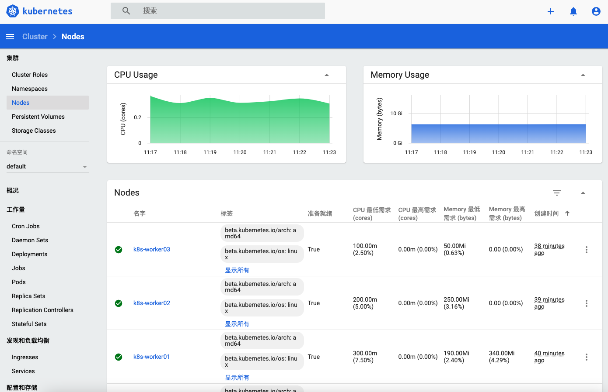

# Kubeadm

## 1. Kubeadm 安装 kubernetes集群

基于 Kubeadm 部署Kubernetes集群。操作系统为 Ubuntu 20.04 LTS，用到的各相关程序版本如下：

- kubernetes: v1.28.6
- docker: 20.10.22
- cri-dockerd: v0.3.8
- cni: flannel

| 主机名          | IP            | 角色     |
|--------------|---------------|--------|
| k8s-master01 | 172.16.192.31 | master |
| k8s-worker01 | 172.16.192.41 | worker |
| k8s-worker02 | 172.16.192.42 | worker |
| k8s-worker03 | 172.16.192.43 | worker |


### 1.1 安装环境准备

```shell
# 主机名解析
cat  >> /etc/hosts <<EOF
172.16.192.31 k8s-master01 k8s-master01.linux.io
172.16.192.41 k8s-worker01 k8s-worker01.linux.io
172.16.192.42 k8s-worker02 k8s-worker02.linux.io
172.16.192.43 k8s-worker03 k8s-worker03.linux.io
# 用于扩展 ApiServer
172.16.192.31 k8s.linux.io
EOF
# 关闭防火墙
ufw  disable
# 禁用swap
systemctl  --type swap
    UNIT          LOAD   ACTIVE SUB    DESCRIPTION
    dev-vda2.swap loaded active active Swap Partition
systemctl  mask dev-vda2.swap
sed  -ri  's@/.*swap.*@# &@' /etc/fstab && swapoff -a

# 设置时区
cp /usr/share/zoneinfo/Asia/Shanghai  /etc/localtime
 date -R
# 时间同步
sudo apt update
sudo apt install -y ntpdate
/usr/sbin/ntpdate ntp.aliyun.com 2&>1 /dev/null
# 设置定时器
~# crontab -l
*/3 * * * * /usr/sbin/ntpdate ntp.aliyun.com 2&>1 /dev/null

# 内核参数设置
cat > /etc/sysctl.d/k8s.conf <<EOF
net.ipv4.ip_forward = 1
net.bridge.bridge-nf-call-iptables = 1
net.bridge.bridge-nf-call-ip6tables = 1
net.bridge.bridge-nf-call-arptables = 1
net.ipv4.tcp_tw_reuse = 0
net.core.somaxconn = 32768
net.netfilter.nf_conntrack_max=1000000
vm.swappiness = 0
vm.max_map_count=655360
fs.file-max=6553600
EOF

sysctl -p

cat >> /etc/modules-load.d/k8s.conf << "EOF"
overlay
br_netfilter
EOF
sudo modprobe overlay
sudo modprobe br_netfilter

# IPVS设置
apt install ipvsadm ipset -y
cat > /etc/modules-load.d/ipvs.conf << "EOF"
#!/bin/bash
ipvs_mods_dir="/usr/lib/modules/$(uname -r)/kernel/net/netfilter/ipvs"
for i in $(ls $ipvs_mods_dir | grep -o "^[^.]*"); do
    /sbin/modinfo -F filename $i  &> /dev/null
    if [ $? -eq 0 ]; then
        /sbin/modprobe $i
    fi
done
EOF
bash /etc/modules-load.d/ipvs.conf
lsmod | grep -e ip_vs -e nf_conntrack_ipv4
```

### 1.2 安装容器运行时

准备 docker 源

```shell
# step 1: 安装必要的一些系统工具
sudo apt-get update
sudo apt-get install ca-certificates curl gnupg

# step 2: 信任 Docker 的 GPG 公钥
sudo install -m 0755 -d /etc/apt/keyrings
curl -fsSL https://mirrors.aliyun.com/docker-ce/linux/ubuntu/gpg | sudo gpg --dearmor -o /etc/apt/keyrings/docker.gpg
sudo chmod a+r /etc/apt/keyrings/docker.gpg

# Step 3: 写入软件源信息
echo \
  "deb [arch=$(dpkg --print-architecture) signed-by=/etc/apt/keyrings/docker.gpg] https://mirrors.aliyun.com/docker-ce/linux/ubuntu \
  "$(. /etc/os-release && echo "$VERSION_CODENAME")" stable" | \
  sudo tee /etc/apt/sources.list.d/docker.list > /dev/null
```
安装 docker

```shell
sudo apt-get update
sudo apt-cache madison docker-ce
sudo apt install -y docker-ce=5:20.10.22~3-0~ubuntu-focal
```

配置docker

```shell
# 镜像加速器
mkdir -pv /etc/docker
sudo cat > /etc/docker/daemon.json <<-'EOF'
{
    "exec-opts": ["native.cgroupdriver=systemd"],
    "registry-mirrors": [
        "https://docker.rainbond.cc"
    ]

}
EOF
systemctl daemon-reload && systemctl restart docker
# docker 代理
mkdir -p /etc/systemd/system/docker.service.d
cat > /etc/systemd/system/docker.service.d/proxy.conf << EOF
[Service]
Environment="HTTP_PROXY=http://172.16.192.1:7890/"
Environment="HTTPS_PROXY=http://172.16.192.1:7890/"
Environment="NO_PROXY=localhost,127.0.0.1,.linux.io,10.244.0.0/16"
EOF
systemctl daemon-reload && systemctl restart docker
docker pull registry.k8s.io/pause:3.6
```


### 1.3. 安装 cri-dockerd


```shell
wget https://github.com/Mirantis/cri-dockerd/releases/download/v0.3.8/cri-dockerd-0.3.8.amd64.tgz
tar -xzvf cri-dockerd-0.3.8.amd64.tgz
sudo install -m 0755 -o root -g root -t /usr/local/bin cri-dockerd/cri-dockerd

wget https://raw.githubusercontent.com/Mirantis/cri-dockerd/master/packaging/systemd/cri-docker.service
wget https://raw.githubusercontent.com/Mirantis/cri-dockerd/master/packaging/systemd/cri-docker.socket

sudo install cri-docker.service /etc/systemd/system
sudo install cri-docker.socket /etc/systemd/system
sudo sed -i -e 's@/usr/bin/cri-dockerd@/usr/local/bin/cri-dockerd@' /etc/systemd/system/cri-docker.service

sudo systemctl daemon-reload
sudo systemctl enable --now cri-docker.socket
sudo systemctl start cri-docker.service && systemctl status cri-docker.service
```

### 1.4. 安装 Kubernetes

准备 kubernetes 源

```shell
apt-get update && apt-get install -y apt-transport-https
sudo mkdir -m 755 /etc/apt/keyrings
curl -fsSL https://mirrors.aliyun.com/kubernetes-new/core/stable/v1.28/deb/Release.key |
    gpg --dearmor -o /etc/apt/keyrings/kubernetes-apt-keyring.gpg
echo "deb [signed-by=/etc/apt/keyrings/kubernetes-apt-keyring.gpg] https://mirrors.aliyun.com/kubernetes-new/core/stable/v1.28/deb/ /" |
    tee /etc/apt/sources.list.d/kubernetes.list
apt-get update
apt-cache madison kubeadm

apt install -y kubeadm=1.28.6-1.1 kubelet=1.28.6-1.1 kubectl=1.28.6-1.1
```

#### 1.4.1 拉取镜像

拉取镜像 
```shell
 kubeadm config images pull --image-repository=registry.cn-hangzhou.aliyuncs.com/google_containers \
--kubernetes-version=1.28.6 \
--cri-socket=unix:///var/run/cri-dockerd.sock
```

#### 1.4.2 初始化 master

配置cri-docker中pause容器

```shell
cp /etc/systemd/system/cri-docker.service{,.bak}
vim  /etc/systemd/system/cri-docker.service
[Unit]
...
[Service]
Type=notify
#ExecStart=/usr/local/bin/cri-dockerd --container-runtime-endpoint fd://
ExecStart=/usr/local/bin/cri-dockerd --pod-infra-container-image=registry.cn-hangzhou.aliyuncs.com/google_containers/pause:3.9 --container-runtime-endpoint fd://

~# systemctl  daemon-reload && systemctl  restart  cri-docker.service && systemctl  status cri-docker.service

for i in k8s-worker01 k8s-worker02 k8s-worker03;do
    scp  /etc/systemd/system/cri-docker.service root@$i:/etc/systemd/system/cri-docker.service
    ssh $i "systemctl  daemon-reload && systemctl  restart  cri-docker.service && systemctl  status cri-docker.service"
done
```
```shell
# 所有节点需要解析 k8s.linux.io, 此域名用于后续扩展集群为高可用集群
kubeadm init --kubernetes-version=v1.28.6 \
    --control-plane-endpoint=k8s.linux.io \
    --apiserver-advertise-address=0.0.0.0 \
    --pod-network-cidr=10.244.0.0/16   \
    --service-cidr=10.96.0.0/12 \
    --image-repository=registry.cn-hangzhou.aliyuncs.com/google_containers \
    --ignore-preflight-errors=Swap \
    --cri-socket=unix:///var/run/cri-dockerd.sock | tee kubeadm-init.log
...
Your Kubernetes control-plane has initialized successfully!

To start using your cluster, you need to run the following as a regular user:

  mkdir -p $HOME/.kube
  sudo cp -i /etc/kubernetes/admin.conf $HOME/.kube/config
  sudo chown $(id -u):$(id -g) $HOME/.kube/config

Alternatively, if you are the root user, you can run:

  export KUBECONFIG=/etc/kubernetes/admin.conf

You should now deploy a pod network to the cluster.
Run "kubectl apply -f [podnetwork].yaml" with one of the options listed at:
  https://kubernetes.io/docs/concepts/cluster-administration/addons/

You can now join any number of control-plane nodes by copying certificate authorities
and service account keys on each node and then running the following as root:

  kubeadm join k8s.linux.io:6443 --token optd4c.4m7ig7i2153pzwrg \
        --discovery-token-ca-cert-hash sha256:7858c18e4bd1cc3ff6a3cbc686cee7a173dd61b62af480af90dd36131c3d5df8 \
        --control-plane

Then you can join any number of worker nodes by running the following on each as root:

kubeadm join k8s.linux.io:6443 --token optd4c.4m7ig7i2153pzwrg \
        --discovery-token-ca-cert-hash sha256:7858c18e4bd1cc3ff6a3cbc686cee7a173dd61b62af480af90dd36131c3d5df8
```

```shell
# 配置 kubectl 客户端
mkdir -p $HOME/.kube
sudo cp -i /etc/kubernetes/admin.conf $HOME/.kube/config
sudo chown $(id -u):$(id -g) $HOME/.kube/config
```

#### 1.4.3 加入 worker

```shell
kubeadm join k8s.linux.io:6443 --token optd4c.4m7ig7i2153pzwrg \
        --discovery-token-ca-cert-hash sha256:7858c18e4bd1cc3ff6a3cbc686cee7a173dd61b62af480af90dd36131c3d5df8 \
        --cri-socket=unix:///var/run/cri-dockerd.sock
        
kubectl  get nodes
NAME           STATUS     ROLES           AGE    VERSION
k8s-master01   NotReady   control-plane   5m6s   v1.28.6
k8s-worker01   NotReady   <none>          2m7s   v1.28.6
k8s-worker02   NotReady   <none>          59s    v1.28.6
k8s-worker03   NotReady   <none>          43s    v1.28.6
```

#### 1.4.4 安装网络插件

```shell
wget https://github.com/flannel-io/flannel/releases/latest/download/kube-flannel.yml
grep -C 5 244 kube-flannel.yml
        }
      ]
    }
  net-conf.json: |
    {
      "Network": "10.244.0.0/16",
      "EnableNFTables": false,
      "Backend": {
        "Type": "vxlan"
      }
    }
 
kubectl  apply -f kube-flannel.yml

~# kubectl  get pod -A
NAMESPACE      NAME                                   READY   STATUS    RESTARTS        AGE
kube-flannel   kube-flannel-ds-b6f7s                  1/1     Running   0               30s
kube-flannel   kube-flannel-ds-jd6r9                  1/1     Running   0               49s
kube-flannel   kube-flannel-ds-pshk2                  1/1     Running   0               5m50s
kube-flannel   kube-flannel-ds-zjmnw                  1/1     Running   0               25s
kube-system    coredns-6554b8b87f-7ng2w               1/1     Running   0               18m
kube-system    coredns-6554b8b87f-snwfx               1/1     Running   0               18m
kube-system    etcd-k8s-master01                      1/1     Running   2 (2m23s ago)   18m
kube-system    kube-apiserver-k8s-master01            1/1     Running   2 (2m ago)      18m
kube-system    kube-controller-manager-k8s-master01   1/1     Running   1 (2m33s ago)   18m
kube-system    kube-proxy-64bv7                       1/1     Running   1               14m
kube-system    kube-proxy-9whqg                       1/1     Running   0               15m
kube-system    kube-proxy-fl9h8                       1/1     Running   1 (2m17s ago)   14m
kube-system    kube-proxy-j7zhh                       1/1     Running   2 (2m23s ago)   18m
kube-system    kube-scheduler-k8s-master01            1/1     Running   1 (2m33s ago)   18m
~# kubectl  get nodes
NAME           STATUS   ROLES           AGE   VERSION
k8s-master01   Ready    control-plane   18m   v1.28.6
k8s-worker01   Ready    <none>          15m   v1.28.6
k8s-worker02   Ready    <none>          14m   v1.28.6
k8s-worker03   Ready    <none>          14m   v1.28.6
```
#### 1.4.5 启用IPVS模式

```shell
kubectl  edit cm kube-proxy -n kube-system
...
    metricsBindAddress: ""
    mode: "ipvs"
    
kubectl  delete pod -l k8s-app=kube-proxy -n kube-system
```

### 1.5. 验证集群

#### 1.5.1 验证网络

创建 Deployment 和 Service 资源

```shell
~# kubectl  create deployment myapp --image=ikubernetes/myapp:v1 --replicas=3
root@k8s-master01:~# kubectl  get pod  -o wide
NAME                     READY   STATUS    RESTARTS   AGE   IP           NODE           NOMINATED NODE   READINESS GATES
myapp-5d9c4b4647-66xvz   1/1     Running   0          85s   10.244.1.4   k8s-worker01   <none>           <none>
myapp-5d9c4b4647-mz2k8   1/1     Running   0          85s   10.244.3.2   k8s-worker03   <none>           <none>
myapp-5d9c4b4647-vlbtb   1/1     Running   0          85s   10.244.2.2   k8s-worker02   <none>           <none>

~# kubectl  expose deployment/myapp --type=NodePort --port=80 --target-port=80
service/myapp exposed
~# kubectl  get svc myapp -o wide
NAME    TYPE       CLUSTER-IP      EXTERNAL-IP   PORT(S)        AGE   SELECTOR
myapp   NodePort   10.111.44.183   <none>        80:32138/TCP   6s    app=myapp
```
通过 Service 或者 NodePort 资源轮询 Pod

```shell
~# for i in `seq 5`;do curl 10.111.44.183/hostname.html;done
myapp-5d9c4b4647-66xvz
myapp-5d9c4b4647-vlbtb
myapp-5d9c4b4647-mz2k8
myapp-5d9c4b4647-66xvz
myapp-5d9c4b4647-66xvz

~# for i in `seq 5`; do curl 172.16.192.31:32138/hostname.html;done
myapp-5d9c4b4647-vlbtb
myapp-5d9c4b4647-mz2k8
myapp-5d9c4b4647-66xvz
myapp-5d9c4b4647-vlbtb
myapp-5d9c4b4647-66xvz
```

> 注意：Service IP 和 NodePort 仅是网络规则，所以不支持ping， 但是支持telnet

#### 1.5.2 验证DNS

```shell
~#  kubectl  get svc -n kube-system -o wide
NAME       TYPE        CLUSTER-IP   EXTERNAL-IP   PORT(S)                  AGE   SELECTOR
kube-dns   ClusterIP   10.96.0.10   <none>        53/UDP,53/TCP,9153/TCP   25m   k8s-app=kube-dns
~#  kubectl  run busybox --image=busybox:1.28 -- sleep 3600
pod/busybox created
~# kubectl  get pod/busybox
NAME      READY   STATUS    RESTARTS   AGE
busybox   1/1     Running   0          11s

~# kubectl  exec -it busybox -- nslookup myapp.default.svc.cluster.local
Server:    10.96.0.10
Address 1: 10.96.0.10 kube-dns.kube-system.svc.cluster.local

Name:      myapp.default.svc.cluster.local
Address 1: 10.111.44.183 myapp.default.svc.cluster.local
```

### 1.6 插件安装

#### 1.6.1 Metrics-Server 安装

```shell
wget https://github.com/kubernetes-sigs/metrics-server/releases/latest/download/components.yaml
vim components.yaml
    spec:
      containers:
      - args:
        - --cert-dir=/tmp
        - --secure-port=10250
        - --kubelet-preferred-address-types=InternalIP,ExternalIP,Hostname
        - --kubelet-use-node-status-port
        - --metric-resolution=15s
        - --kubelet-insecure-tls

kubectl  apply -f components.yaml 

~# kubectl  top nodes
NAME           CPU(cores)   CPU%   MEMORY(bytes)   MEMORY%
k8s-master01   160m         4%     2165Mi          27%
k8s-worker01   52m          1%     1583Mi          20%
k8s-worker02   52m          1%     1401Mi          17%
k8s-worker03   44m          1%     1396Mi          17%
```

#### 1.6.2 Dashboard 安装

部署 dashboard

```shell
wget https://raw.githubusercontent.com/kubernetes/dashboard/v2.0.0/aio/deploy/recommended.yaml
kubectl  apply -f recommended.yaml 
kubectl  patch -n kubernetes-dashboard svc/kubernetes-dashboard -p '{"spec": {"type": "NodePort"}}'

kubectl  get svc -n kubernetes-dashboard
NAME                        TYPE        CLUSTER-IP      EXTERNAL-IP   PORT(S)         AGE
dashboard-metrics-scraper   ClusterIP   10.110.240.66   <none>        8000/TCP        32s
kubernetes-dashboard        NodePort    10.97.48.13     <none>        443:31288/TCP   32s
```

创建用户用来访问 dashboard

```shell
vim admin-user.yaml 
---
apiVersion: v1
kind: ServiceAccount
metadata:
  name: admin-user
  namespace: kubernetes-dashboard
---
apiVersion: rbac.authorization.k8s.io/v1
kind: ClusterRoleBinding
metadata:
  name: admin-user
roleRef:
  apiGroup: rbac.authorization.k8s.io
  kind: ClusterRole
  name: cluster-admin
subjects:
- kind: ServiceAccount
  name: admin-user
  namespace: kubernetes-dashboard

kubectl apply -f admin-user.yaml

kubectl -n kubernetes-dashboard create token admin-user
```

访问 dashboard ：`http://IP:31288`


> 如果google不允许访问https，请在访问页面输入 `thisisunsafe` 解决


