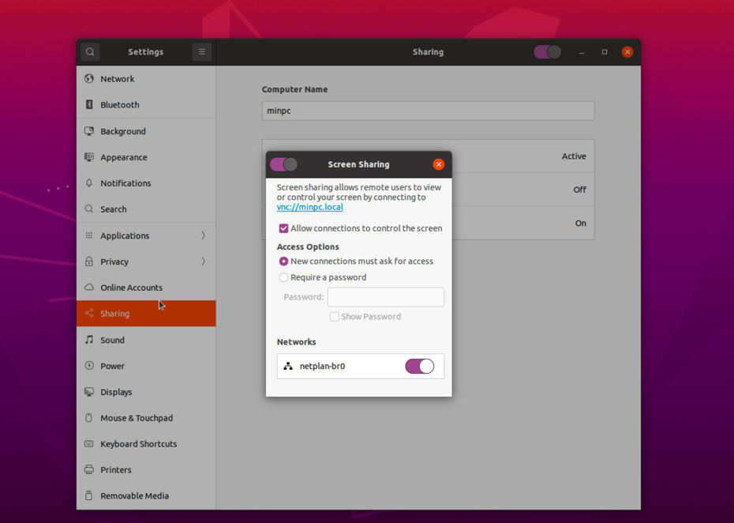
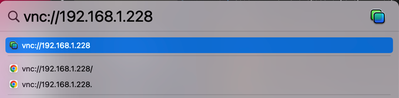
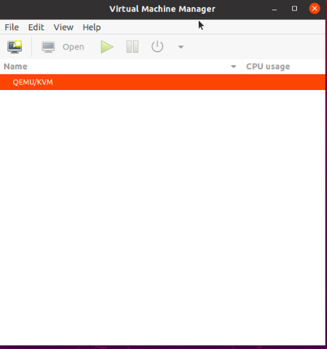
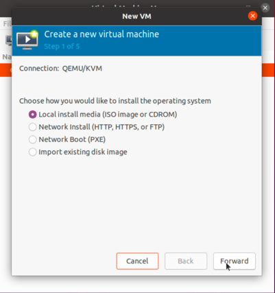
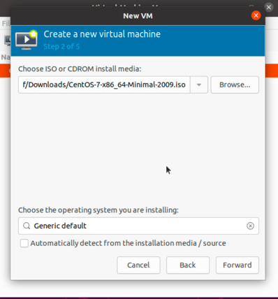
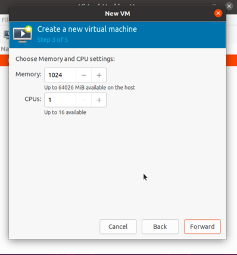
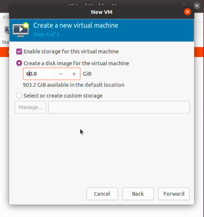
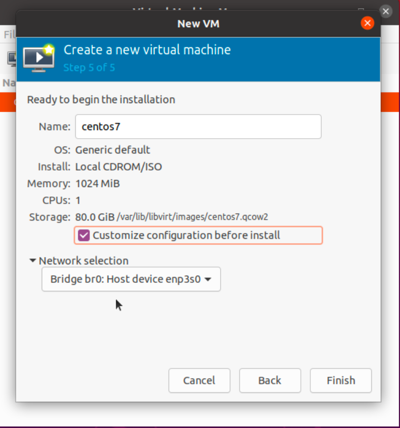
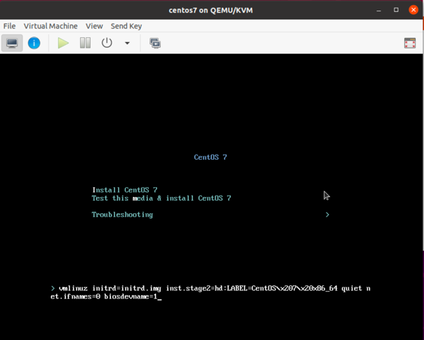

# kvm虚拟化

##  1. 在Ubuntu 上安装 KVM

### 1.1 KVM Hypervisor 要求

验证 CPU 虚拟化扩展是否可用

```shell
~$ sudo egrep -c '(vmx|svm)' /proc/cpuinfo
32
```

确定 KVM 内核模块是否已加载

```shell
~$ lsmod | grep kvm
kvm_intel             380928  0
kvm                  1015808  1 kvm_intel
```

是否可以使用KVM加速

```shell
~$ sudo apt install cpu-checker
~$ sudo kvm-ok
INFO: /dev/kvm exists
KVM acceleration can be used
```

### 1.2 安装KVM软件包

```shell
~$ sudo apt install qemu-kvm libvirt-daemon-system libvirt-clients bridge-utils -y
```

### 1.3 授权用户

只有libvirt和kvm用户组的成员才能运行虚拟机。如果您希望特定用户运行虚拟机，请将他们添加到这些用户组。

```shell
sudo adduser dengyouf libvirt
sudo adduser dengyouf kvm
```

### 1.4 验证安装

```shell
~$ sudo virsh  list --all
 Id   Name   State
--------------------

~$ sudo systemctl enable --now libvirtd
~$ sudo systemctl status libvirtd
```

## 2. KVM 设置桥接网络

### 2.1 在服务器上创建一个新接口 br0

```shell
~$ cd /etc/netplan/
~$ sudo cp 01-network-manager-all.yaml  01-network-manager-all.yaml.bak
echo "
network:
  version: 2
  renderer: NetworkManager
  ethernets:
    enp3s0:
      dhcp4: false
      dhcp6: false
  bridges:
    br0:
      interfaces: [enp3s0]
      addresses: [192.168.1.228/24]
      gateway4: 192.168.1.1
      nameservers:
        addresses: [8.8.8.8,8.8.4.4]
      parameters:
        stp: false
        forward-delay: 0
      dhcp4: no
      dhcp6: no
"|sudo tee 01-network-manager-all.yaml

~$ sudo netplan  apply
```

## 3. 安装虚拟机

### 3.1 mac vnc远程 ubuntu 桌面

- ubuntu 安装配置x11vnc

```shell
~$ sudo apt-get install x11vnc -y
# 设置vnc密码
~$ sudo x11vnc -storepasswd /etc/x11vnc.pass

~$ echo "
[Unit]
Description=Start x11vnc at startup.
After=multi-user.target
[Service]
Type=simple
ExecStart=/usr/bin/x11vnc -auth /run/user/1000/gdm/Xauthority -forever -loop -noxdamage -repeat -rfbauth /etc/x11vnc.pass -rfbport 5900 -shared
[Install]
WantedBy=multi-user.target
" |sudo tee /etc/systemd/system/x11vnc.service

~$ sudo systemctl enable x11vnc
```
- 开启远程访问

在【Setting】 -> 【Sharing】中打开 Screen Sharing 


- mac连接 ubuntu

按住 command + Space 键 输入 vnc://IP 即可进行连接,也可以在浏览器直接输入vnc://IP。


### 3.2 使用 virt-manager 安装虚拟机

- 安装客户端

```shell
~$ sudo apt install virt-manager -y
```

- 以 root 用户身份执行 virt-manager 命令打开 virt-manager

```shell
~$ sudo virt-manager
```

- 启动新的虚拟化客户机向导,  打开 New vm 窗口



- 指定安装类型-本地安装介质（ISO 镜像或 CDROM）



- 选择要安装的ISO镜像和系统版本，默认会识别，如果识别不了，请选择 Generic default



- 配置 vm 的 RAM 数量和 CPU 数量



- 配置 vm 硬盘



- 配置 vm 名称和 network




- 安装  vm

安装是传入参数 net.ifnames=0 biosdevname=1 修改网卡名称为 ethx



### 3.3 查看 vm 配置

- 每个VM配置文件都存放在/etc/libvirt/qemu目录下的xml文件中

```shell
~$ sudo cat /etc/libvirt/qemu/centos7.xml
<!--
WARNING: THIS IS AN AUTO-GENERATED FILE. CHANGES TO IT ARE LIKELY TO BE
OVERWRITTEN AND LOST. Changes to this xml configuration should be made using:
  virsh edit centos7
or other application using the libvirt API.
-->

<domain type='kvm'>         <!-- domain 虚拟机的根元素, 定义使用哪个虚拟机管理程序 -->
  <name>centos7</name>         <!-- name 定于虚拟机名称 -->
  <uuid>f352f58a-9c7d-4e68-b83d-2a8857ba6ab4</uuid>         <!-- uuid 每个虚拟机的个性化配置,需唯一 -->
  <memory unit='KiB'>1048576</memory>         <!-- memory 虚拟机使的最大内存,此处为1G 即 1*1024*1024 -->   
  <currentMemory unit='KiB'>1048576</currentMemory>         <!-- 在虚拟机使用free -m 命令可以看见的内存大小, 一般与 memory 保持一致 -->   
  <vcpu placement='static'>1</vcpu>         <!-- cpu 的数量 -->   
  <os>         <!-- 系统引导配置 -->
    <type arch='x86_64' machine='pc-i440fx-focal'>hvm</type>         <!-- hvm 表示全虚拟化 -->
    <boot dev='hd'/>         <!-- 指定启动设置, hd表示从硬盘启动 -->
  </os>
  <features>
    <acpi/>
    <apic/>
    <vmport state='off'/>
  </features>
  <cpu mode='host-model' check='partial'/>         <!-- cpu特性, mode='host-passthrough', 表示cpu嵌套虚拟化配置-->
  <clock offset='utc'>
    <timer name='rtc' tickpolicy='catchup'/>
    <timer name='pit' tickpolicy='delay'/>
    <timer name='hpet' present='no'/>
  </clock>
  <on_poweroff>destroy</on_poweroff>
  <on_reboot>restart</on_reboot>
  <on_crash>destroy</on_crash>
  <pm>
    <suspend-to-mem enabled='no'/>
    <suspend-to-disk enabled='no'/>
  </pm>
  <devices>
    <emulator>/usr/bin/qemu-system-x86_64</emulator>         <!-- 模拟器配置-->
    <disk type='file' device='disk'>         <!-- 硬盘配置, 需手动修改, 可以通过复制此段配置创建新的磁盘-->
      <driver name='qemu' type='qcow2'/>         <!-- 磁盘驱动类型 -->
      <source file='/var/lib/libvirt/images/centos7.qcow2'/>         <!-- 磁盘路径 -->
      <target dev='hda' bus='ide'/>
      <address type='drive' controller='0' bus='0' target='0' unit='0'/>
    </disk>
    <disk type='file' device='cdrom'>
      <driver name='qemu' type='raw'/>
      <target dev='hdb' bus='ide'/>
      <readonly/>
      <address type='drive' controller='0' bus='0' target='0' unit='1'/>
    </disk>
    <controller type='usb' index='0' model='ich9-ehci1'>
      <address type='pci' domain='0x0000' bus='0x00' slot='0x05' function='0x7'/>
    </controller>
    <controller type='usb' index='0' model='ich9-uhci1'>
      <master startport='0'/>
      <address type='pci' domain='0x0000' bus='0x00' slot='0x05' function='0x0' multifunction='on'/>
    </controller>
    <controller type='usb' index='0' model='ich9-uhci2'>
      <master startport='2'/>
      <address type='pci' domain='0x0000' bus='0x00' slot='0x05' function='0x1'/>
    </controller>
    <controller type='usb' index='0' model='ich9-uhci3'>
      <master startport='4'/>
      <address type='pci' domain='0x0000' bus='0x00' slot='0x05' function='0x2'/>
    </controller>
    <controller type='pci' index='0' model='pci-root'/>
    <controller type='ide' index='0'>
      <address type='pci' domain='0x0000' bus='0x00' slot='0x01' function='0x1'/>
    </controller>
    <controller type='virtio-serial' index='0'>
      <address type='pci' domain='0x0000' bus='0x00' slot='0x06' function='0x0'/>
    </controller>
    <interface type='bridge'>
      <mac address='52:54:00:78:87:c7'/>
      <source bridge='br0'/>
      <model type='e1000'/>
      <address type='pci' domain='0x0000' bus='0x00' slot='0x03' function='0x0'/>
    </interface>
    <serial type='pty'>
      <target type='isa-serial' port='0'>
        <model name='isa-serial'/>
      </target>
    </serial>
    <console type='pty'>
      <target type='serial' port='0'/>
    </console>
    <channel type='spicevmc'>
      <target type='virtio' name='com.redhat.spice.0'/>
      <address type='virtio-serial' controller='0' bus='0' port='1'/>
    </channel>
    <input type='tablet' bus='usb'>
      <address type='usb' bus='0' port='1'/>
    </input>
    <input type='mouse' bus='ps2'/>
    <input type='keyboard' bus='ps2'/>
    <graphics type='spice' autoport='yes'>
      <listen type='address'/>
      <image compression='off'/>
    </graphics>
    <sound model='ich6'>
      <address type='pci' domain='0x0000' bus='0x00' slot='0x04' function='0x0'/>
    </sound>
    <video>
      <model type='qxl' ram='65536' vram='65536' vgamem='16384' heads='1' primary='yes'/>
      <address type='pci' domain='0x0000' bus='0x00' slot='0x02' function='0x0'/>
    </video>
    <redirdev bus='usb' type='spicevmc'>
      <address type='usb' bus='0' port='2'/>
    </redirdev>
    <redirdev bus='usb' type='spicevmc'>
      <address type='usb' bus='0' port='3'/>
    </redirdev>
    <memballoon model='virtio'>
      <address type='pci' domain='0x0000' bus='0x00' slot='0x07' function='0x0'/>
    </memballoon>
  </devices>
</domain>
```

## 4. 虚拟机克隆

基于安装好的 ubuntu20.04 虚拟机进行机器克隆

### 4.1 查看模版虚拟机的状态

```shell

~$ virsh  list --all
 Id   Name          State
------------------------------
 -    ubuntu20.04   shut off
```

### 4.2 克隆虚拟机

```shell
~$ virt-clone --auto-clone -o ubuntu20.04 -n k8s-master01
```

### 4.2 定制虚拟机

- 安装 libguestfs-tools

```shell
~$ sudo apt install libguestfs-tools
```

- 修改主机IP地址和主机名

```shell
# 192.168.1.254 为模版机器 IP
~$ sudo virt-sysprep  \
--operations defaults,machine-id,-ssh-userdir,-lvm-uuids \
--hostname k8s-master01 \
--run-command "sed -i 's@192.168.1.254@192.168.1.11@g' /etc/netplan/00-installer-config.yaml && dpkg-reconfigure openssh-server" \
-d k8s-master01
```


